# Final Project - Gomoku Online Lobby
Course:
CSCI 2020U - Software Systems Development and Integration

## Table of Contents
1.[Project Information](#project-information) 
2.[How to Run](#how-to-run) 
3.[Other resources](#other-resources) 
4.[Contribution Report](#contribution-report) 

## Project Information

This project is a working multiplayer board game with an integrated chat system. The project uses WebSockets and HTML/CSS/JS in a Java Web Application. The game server is able to host multiple games synchronously with an independent chat room in each game. The game has functional game logic and win conditions, and the chat system has many quality-of-life features such as image uploads and status settings.

Upon joining, the user is able to create a new game room or join an existing one. When in the game room, the user is prompted to enter their username before taking any actions. The user can then chat or press the "Start Game" button to begin playing. If there are more than 2 players in the game room, additional users cannot play, but they can still watch and chat in real-time. As part of the rules of Gomoku, the 2 players will go back and forth, placing their pieces until they have 5 of their pieces in a straight vertical, horizontal, or diagonal line. Once the game is over and everyone leaves the room, it will be deleted. 

Group Members:
- Alan Ward 
- Ali Hu 
- Alreda Alhadi 
- Joshua Juan 

Video of The Application Running: 

https://github.com/OntarioTech-CS-program/w24-csci2020u-final-project-alhadi-hu-ward-juan/assets/114015131/185d08fa-51d3-43bf-94fd-c2b1d5ca6904

 
Just in case the video does not play here, the video file of the screen recording is also provided at 'images/ScreenRecording/finalDemo.mp4'

## How to Run

Before being able to run the application, you need to clone this repository from the GitHub page onto your own machine. You should already be on the GitHub page, but if you aren't, <a href="https://github.com/OntarioTech-CS-program/w24-csci2020u-final-project-alhadi-hu-ward-juan">click here</a>. We are also assuming that you will run IntelliJ IDEA as an administrator.

### To clone the application
1. Click on green button that says "<> Code". 
    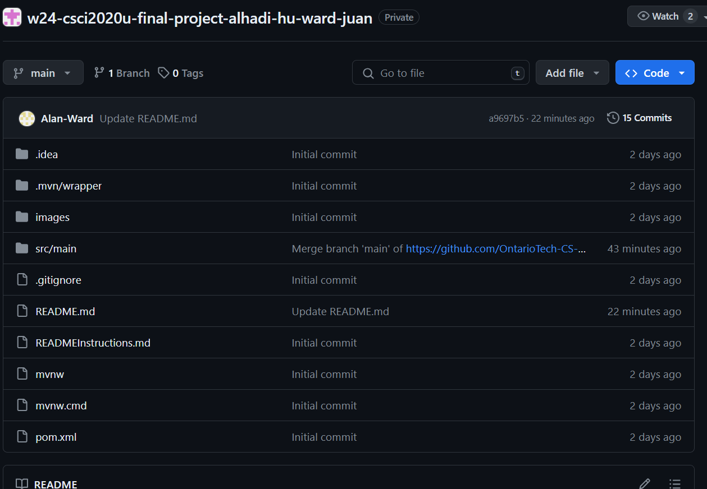
      
2. Copy the HTTPS git clone URL. 
    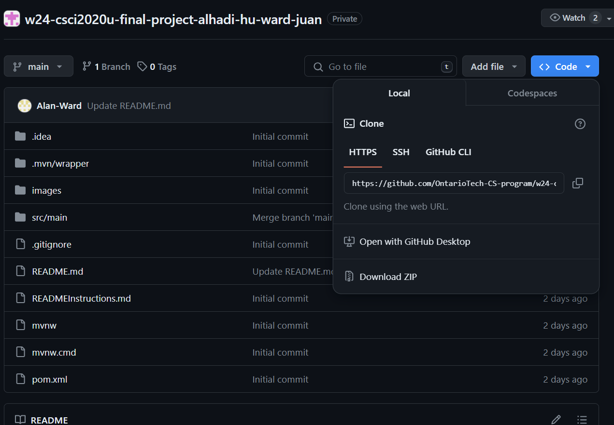
      
3. Open the IntelliJ IDEA project tab, and click the button in the top right that says "Get from VCS". 
    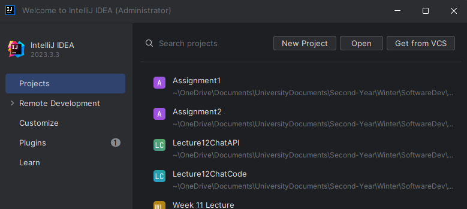
      
4. Paste the HTTPS GitHub repository clone URL into the URL input field, and select the directory you'd like to clone the repository into. 
    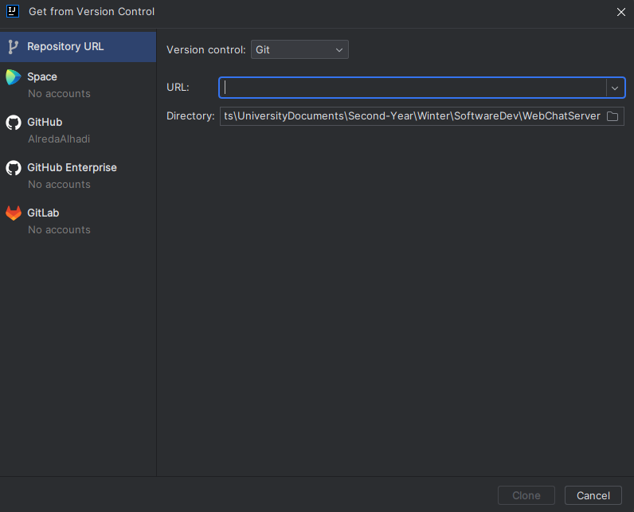
      
5. Click the Clone button to clone the application repository into your desired directory. This should only take a short period of time. 
    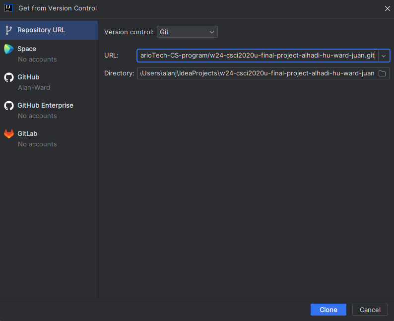
      
6. IntelliJ may ask if you want to Trust and Open the project, click "Trust Project" 
    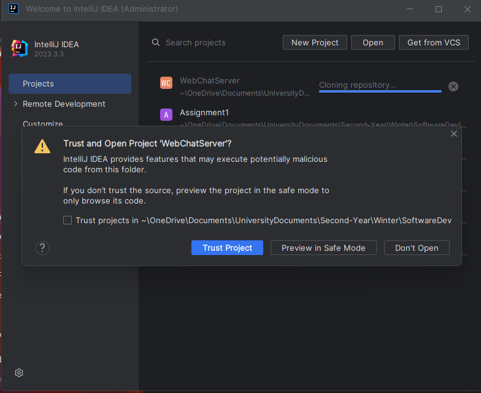
      

### To run the application

1. On Intellij, Open the directory that you cloned the repository into (this should have automatically happened right after you cloned the repository in the previous steps). 
    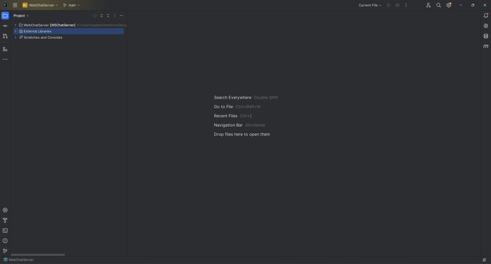
      
2. In the top right corner, click on "Current File", then click on "Edit Configurations..." 
    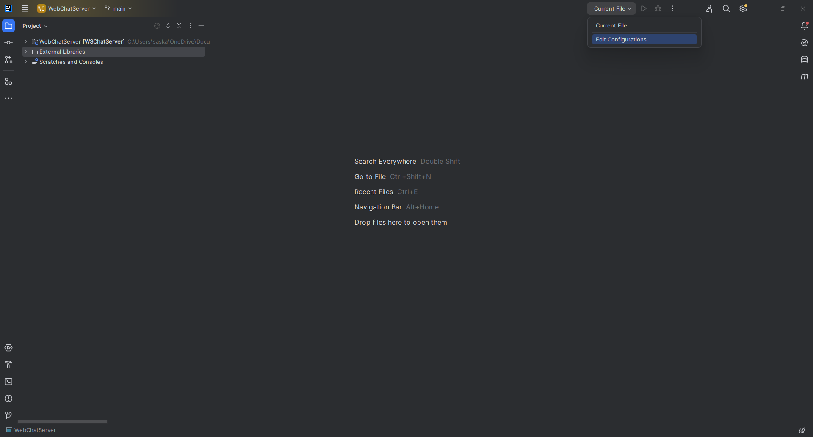
      
3. In the "Run/Debug Configurations" window, click the + symbol in the top left corner, then select a local glassFish Server. 
    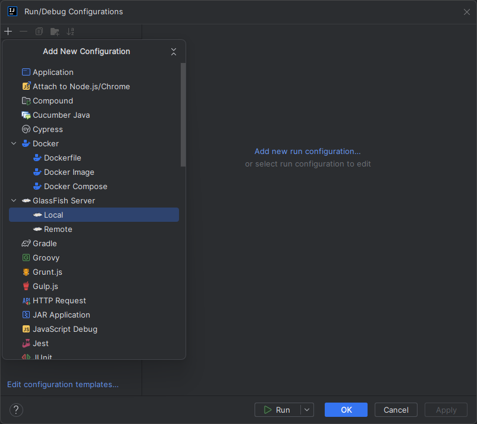
      
4. In the "Server Domain" input field, enter "domain1", and in the JRE input field select a JRE that's version 21 or newer. Then click on the Deployment tab.  
    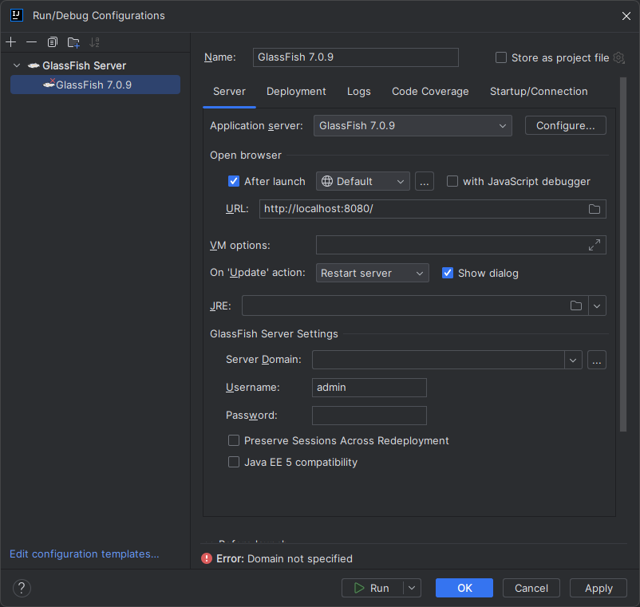
      
5. In the Deployment tab, click the + sign and select artifact.  
    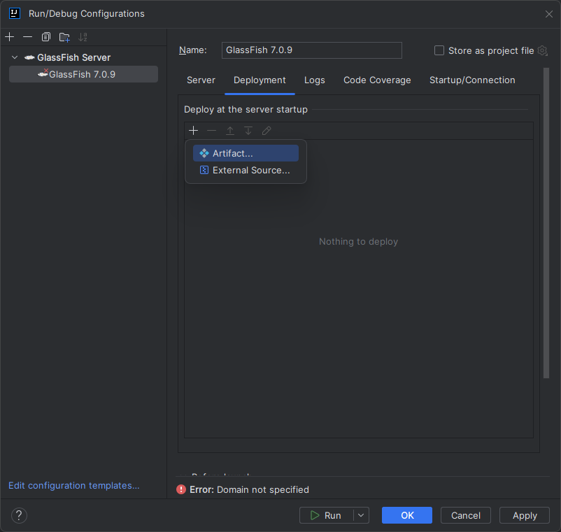
      
6. Select "WSChatServer:war exploded" and click OK  
    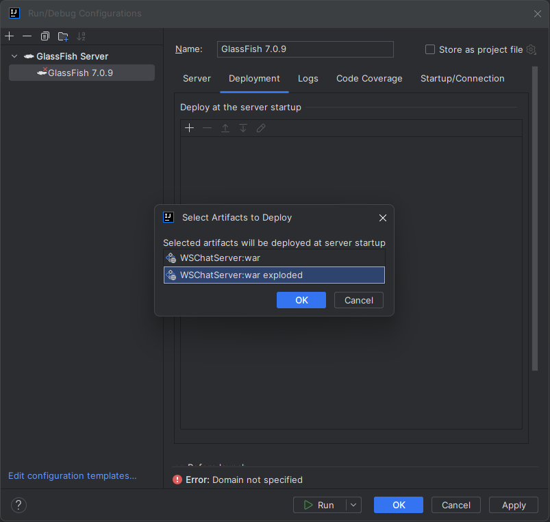
      
7. Now that you're done with the Run Configurations, click the 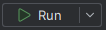 button to finally run the application  
    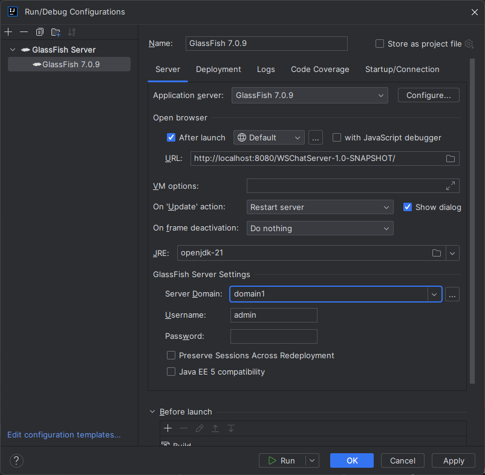
      
8. After a short period of time, the server should be deployed and the client will open in your default browser, where the Chat Server webpage will appear.  
     <be>

## Other Resources
idk if we need this part

https://en.wikipedia.org/wiki/Gomoku

## Contribution Report
### Contributions:
**All group members contributed relatively equally**
- Ali Hu:
    - implmented the backend game logic to keep track of players and the game board
    - included semaphores to prevent race condition when accessing game rooms
- Alreda Alhadi:
    - 
- Alan Ward:
    - HTML/CSS/JS design and audio
- Joshua Juan:
    - 
